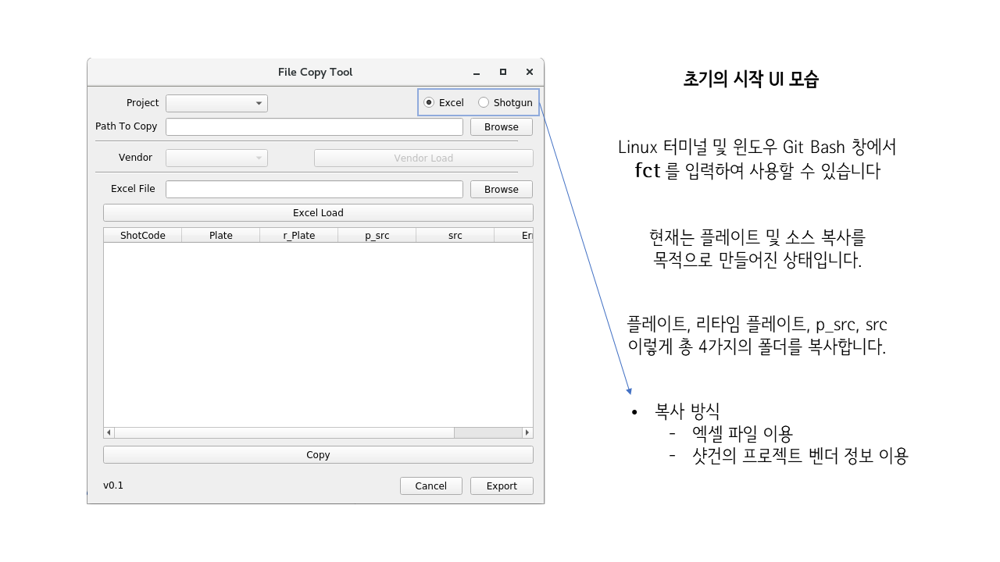
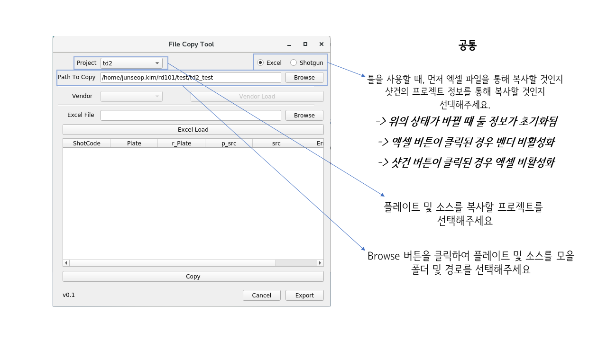
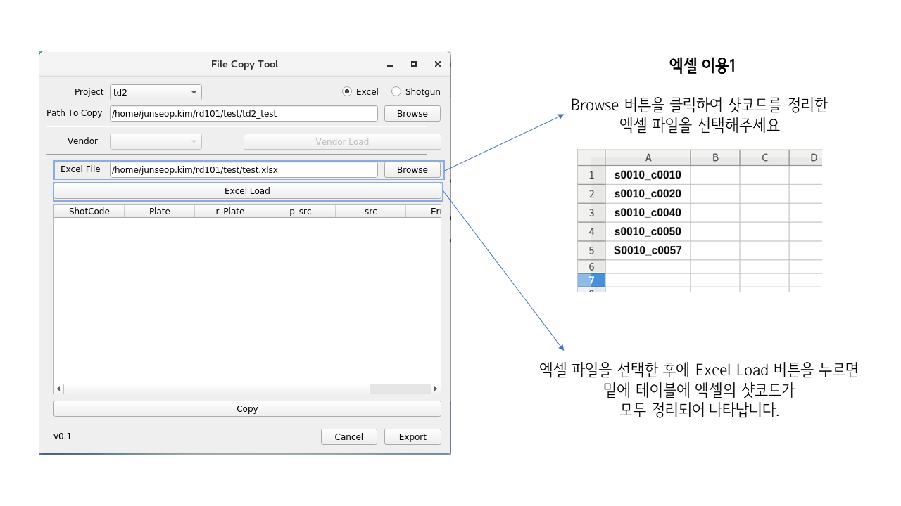
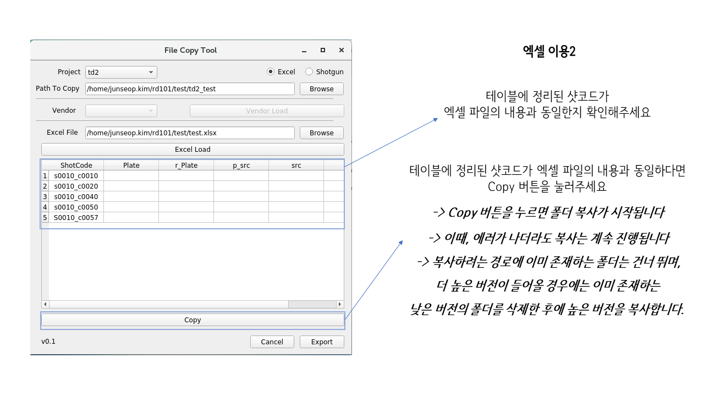
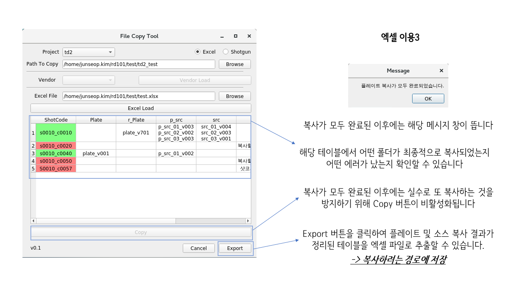
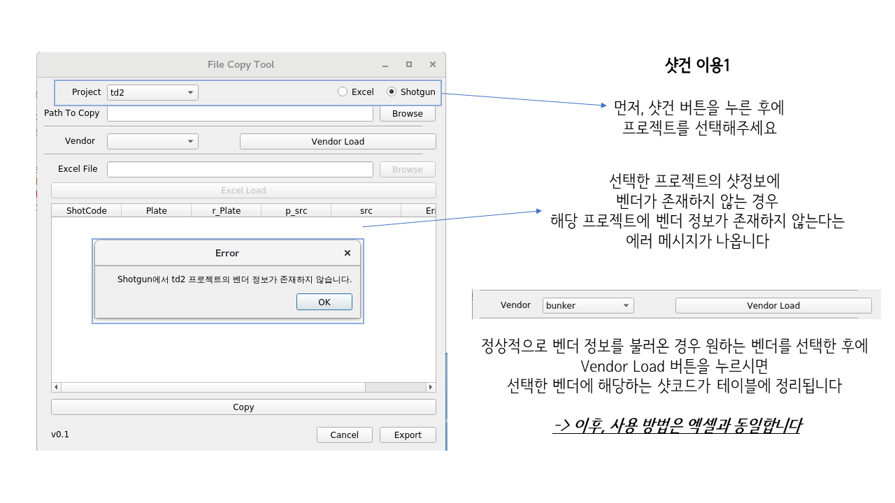

# fileCopyTool
플레이트 등의 파일을 복사하는 File Copy Tool입니다.   
현재는 PD팀에서 사용하도록 엑셀 파일 또는 샷건의 벤더 정보를 이용하여 샷코드를 가져오고   
그 샷코드를 기반으로 플레이트, 리타임 플레이트, 소스, 플레이트 소스를 원하는 경로에 복사하는 툴입니다.

추후에 파이프라인 내의 각 팀에서 Publish한 데이터를 한번에 복사하여 모으는 기능이 개발되어야합니다.
 
- [개발백서](./docs/development.md)

 

### 개발 현황

v0.1: PD 팀에서 플레이트 및 소스를 엑셀을 로드하거나, 샷건 정보를 가져와서 지정한 경로에 복사하는 툴입니다.

 

### 사용 매뉴얼

